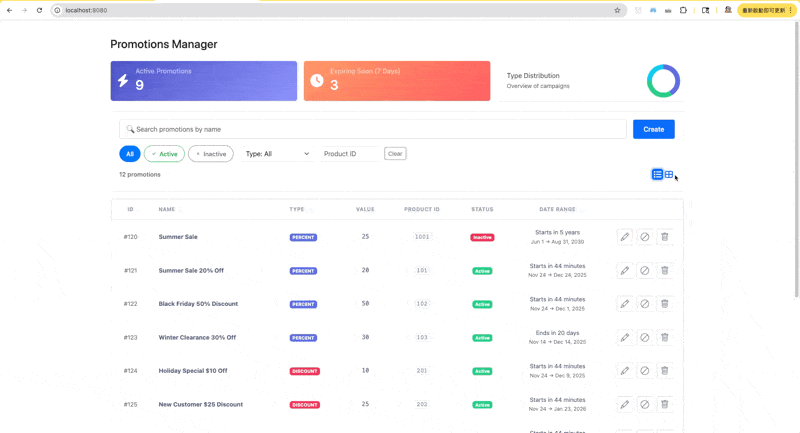

# Promotions Service

[](https://opensource.org/licenses/Apache-2.0)
[](https://python.org/)
[](https://github.com/CSCI-GA-2820-FA25-003/promotions/actions)
[](https://codecov.io/gh/CSCI-GA-2820-FA25-003/promotions)

A production-style REST API for managing promotions, built with Python and Flask.

This service provides a robust and consistent API for CRUD operations and querying of promotion records. It emphasizes clear and explicit API design, moving away from ambiguous legacy concepts.

## UI Screenshots



## Key Features

*   **Predictable API**: Easy to integrate with consistent behavior and clear filtering.
*   **Data Integrity**: Ensures valid data entry and reliable, atomic transactions.
*   **Flexible Management**: Safely deactivate promotions while preserving history.
*   **High Availability**: Designed for robust operation in cloud environments.

## Technology Stack

*   **Backend**: Python, Flask, Flask-SQLAlchemy
*   **Database**: PostgreSQL
*   **Containerization**: Docker
*   **CI/CD**: GitHub Actions, Tekton Pipelines (OpenShift)
*   **Testing**: PyTest, Behave, Codecov

## Quick Start

1.  **Open in VS Code DevContainer**:
    *   Open the Command Palette (Ctrl+Shift+P or Cmd+Shift+P) and select "Dev Containers: Reopen in Container".
    *   This will build the development container and open the project inside it, with all necessary dependencies pre-installed.

2.  **Initialize the database**:
    ```bash
    # Create database tables
    flask db-create

    # Load sample data for testing(optional)
    flask load-data
    ```
    
3.  **Run the server**:
    ```bash
    flask run
    ```
    The service will be available at `http://127.0.0.1:8080` by default.

4.  **Check syntax**:
    ```bash
    make lint
    ```

5.  **Run tests**:
    ```bash
    make test
    ```
6.  **Run BDD tests**:
    ```bash
    behave
    ```

## Kubernetes Deployment

Deploy to a local K3D/K3S cluster:

```bash
# Create K3S cluster with registry
make cluster

# Build Docker image
make build

# Push image to registry
make push

# Deploy to Kubernetes
make deploy
```

Verify deployment:
```bash
curl -H "Host: promotions.local" http://localhost:8080/health
```

For detailed instructions, see [Deployment Guide](docs/DEPLOYMENT.md).

## API & Swagger

- **Base path:** All REST endpoints are prefixed with `/api` (e.g., `/api/promotions`).
- **Swagger UI:** Available at `/apidocs/` when the service is running (e.g., http://localhost:8080/apidocs/).
- **Common examples:**
  ```bash
  # List promotions
  curl http://localhost:8080/api/promotions

  # Create a promotion
  curl -X POST http://localhost:8080/api/promotions \
    -H "Content-Type: application/json" \
    -d '{"name":"Black Friday","promotion_type":"PERCENT","value":25,"product_id":123,"start_date":"2025-11-01","end_date":"2025-11-30"}'
  ```

---

## Documentation

* [Architecture](docs/ARCHITECTURE.md)
* [API Reference](docs/API.md)
* [Deployment Guide](docs/DEPLOYMENT.md)
* [Minikube Guide](docs/MINIKUBE.md)
* [Testing Guide](docs/TESTING.md)
* [CI Commands](docs/CI.md)

---

## Project Structure

```
## 📂 Project Structure

```text
.
├── docs/               # Project documentation (Architecture, API, Deployment, etc.)
├── features/           # BDD scenarios and steps (Behave)
├── k8s/                # Kubernetes manifests (Deployment, Service, Ingress, DB)
├── scripts/            # DevOps helper scripts
├── service/            # Application source code
│   ├── common/         # Shared utilities (logs, error handlers)
│   ├── models.py       # Database models
│   ├── routes.py       # API endpoints
│   └── static/         # Frontend assets (HTML/CSS/JS)
├── tests/              # Unit and integration tests (Pytest)
├── .tekton/            # Tekton CI/CD pipeline definitions (hidden dir)
├── check_syntax.py     # Syntax checker script
├── Dockerfile          # Container definition
├── Makefile            # Command automation
└── wsgi.py             # WSGI entry point
```

## License

Copyright (c) 2016, 2025 [John Rofrano](https://www.linkedin.com/in/JohnRofrano/). All rights reserved.


Licensed under the Apache License. See [LICENSE](LICENSE)

This repository is part of the New York University (NYU) masters class: **CSCI-GA.2820-001 DevOps and Agile Methodologies** created and taught by [John Rofrano](https://cs.nyu.edu/~rofrano/), Adjunct Instructor, NYU Courant Institute, Graduate Division, Computer Science, and NYU Stern School of Business.
